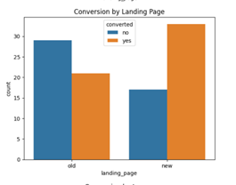
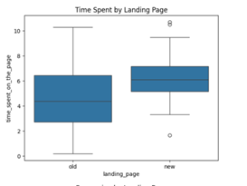
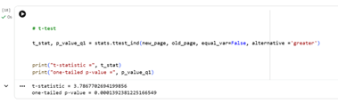

#📰 E-News Express A/B Testing Project

## ✅ Project Overview 

E-News Express wants to increase user engagement and improve subscription conversion on its website. The company needs to understand the effectiveness of the new landing page in gathering new subscribers for the news portal.

✅ Objective

The objective of this project is to analyze A/B testing results and determine whether the new landing page leads to higher user engagement and conversion rates compared with the old landing page.

✅ Skills Used

* Python
* Pandas
* NumPy
* Data Visualization
* Exploratory Data Analysis
* Hypothesis Testing
* A/B Testing
* Statistical Inference
* Business Analytics

✅ Statistical Tests

* Shapiro-Wilk Test
* Levene’s Test
* Independent Two-Sample T-Test
* Z-Test for Proportions
* Chi-Square Test of Independence
* One-Way ANOVA

✅ Key Insights

* Users who viewed the new landing page spent more time on the page than users who viewed the old landing page.
* The new landing page showed a higher conversion rate than the old landing page.
* The difference in conversion between groups was statistically significant.
* Language preference and conversion rate are independent-indicting that readers' language preference may not affect conversion rate.
* The statistical results suggest that the new landing page is more effective in improving user engagement and subscription conversion.

✅ Business Recommendations

* E-News Express should consider replacing the old landing page with the new landing page.
* The company should continue monitoring conversion rates after implementation to confirm long-term effectiveness.
* Marketing teams can use the new landing page design as a reference for future campaigns.
* The company should further analyze user behavior by language preference to support more personalized content strategies.
* Additional A/B tests can be conducted on headlines, call-to-action buttons, and page layout to further improve conversion.

 📊 Sample Visualizations

### Conversion Rate Comparison

### Time Spent on New vs Old Landing Page

### Hypothesis Testing Result

